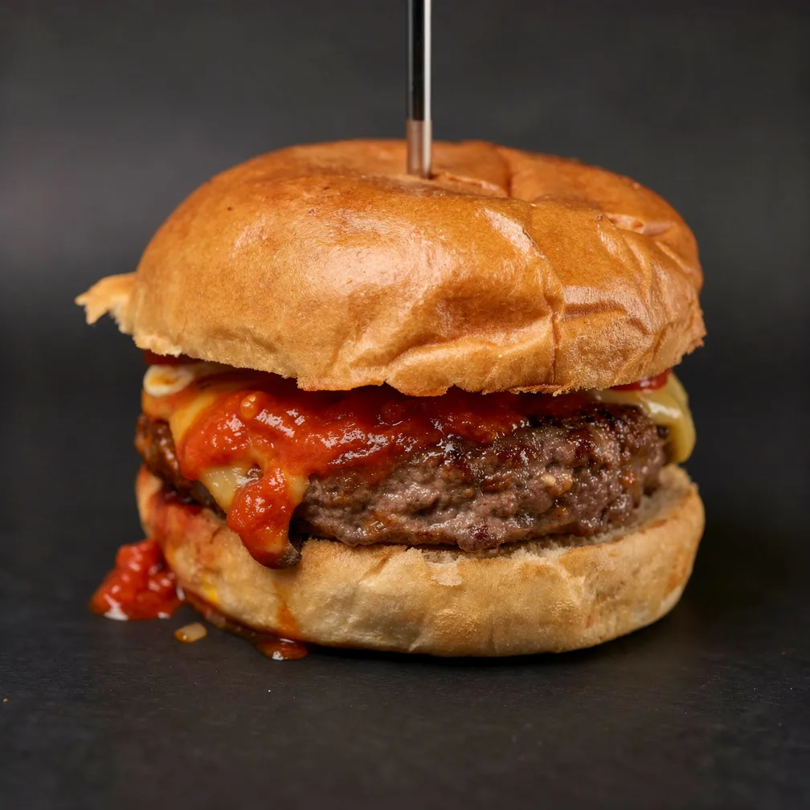

# Food Premium AI Enhancer 🍲

Pipeline de visão computacional e IA generativa para validar imagens gastronômicas e transformá-las em fotos comerciais otimizadas para cardápios digitais, delivery e redes sociais.

O projeto combina um backend em Django REST Framework, um modelo local de detecção de objetos com RT-DETR e integração com modelos generativos como Gemini e FLUX. A proposta é evitar chamadas desnecessárias para APIs externas validando primeiro se a imagem enviada contém alimentos permitidos.

---

## 📊 Antes vs. Depois

Abaixo está um exemplo real do pipeline processando uma imagem amadora enviada pelo usuário, gerando um prompt gastronômico otimizado e transformando o resultado em uma imagem comercial para uso em cardápios digitais.

| Foto amadora enviada pelo usuário                                        | Resultado otimizado por IA                                                                |
| ------------------------------------------------------------------------ | ----------------------------------------------------------------------------------------- |
|                  |                            |
| Imagem original com iluminação simples, fundo comum e aparência amadora. | Imagem final com iluminação aprimorada, textura mais valorizada e apresentação comercial. |

---

## 🤖 Exemplo de Prompt Gerado

Após a validação da imagem, o sistema usa as classes detectadas para gerar um prompt otimizado para o modelo de difusão.

```json
{
  "flux_prompt": "Transform the provided image into a professional commercial food photography shot for a premium Brazilian delivery app like iFood, while strictly preserving the original burger's identity, structure, ingredients, proportions, camera angle, framing, and composition.

Keep the same handmade hamburger from the reference image: soft golden burger bun, visible thick beef patty, melted cheese, red tomato sauce/ketchup dripping from the side, wooden skewer/toothpick inserted vertically through the bun, served on white parchment/wrapping paper. Preserve the same front-facing close-up angle and the same overall placement of every visible ingredient.

Improve only the photographic quality: professional restaurant product photography, appetizing but realistic lighting, sharper focus, cleaner details, improved exposure, natural color correction, enhanced texture of the bun and beef, subtle glossy highlights on the sauce and melted cheese, soft background blur, realistic shadows, high-end delivery menu photo, natural depth of field, DSLR / iPhone Pro commercial food photography style.

The final image must look like the same original burger photographed professionally, not a different burger.",

 "flux_negative_prompt": "Do not change the burger recipe. Do not add lettuce, tomato slices, onions, bacon, sesame seeds, fries, plate, napkins, logo, text, hands, drinks, extra ingredients, garnish, or sauce that is not present in the reference image. Do not remove the wooden skewer. Do not change the angle, crop, composition, bun shape, patty size, sauce position, or ingredient layout. Do not make it look like a generic stock photo. Do not over-perfect the burger. Do not create a new burger. Avoid cartoon style, illustration, CGI, artificial plastic texture, unrealistic shine, oversaturation, extreme bokeh, distorted food, melted deformed bun, duplicated ingredients, extra patties."
}
```

---

## 🏗️ Visão Geral do Pipeline

O usuário envia uma foto amadora de um prato, lanche ou produto gastronômico. Antes de chamar qualquer modelo generativo, o backend executa uma etapa local de visão computacional para identificar os objetos presentes na imagem.

Se o conteúdo detectado for compatível com classes gastronômicas permitidas, o sistema gera um prompt otimizado com auxílio do Gemini e envia a imagem para um modelo de difusão, responsável por melhorar iluminação, textura, enquadramento e apresentação visual.

Caso alguma API externa falhe, o backend utiliza estratégias de fallback para manter o fluxo funcionando de forma degradada, sem interromper completamente a experiência do usuário.

---

## 🔁 Fluxo de Processamento

1. O usuário faz upload da imagem no frontend em Streamlit.
2. A imagem é enviada para a API Django.
3. O backend valida o conteúdo usando RT-DETR localmente.
4. As classes detectadas são enviadas para o Gemini.
5. O Gemini gera um prompt gastronômico otimizado.
6. O prompt e a imagem são enviados para o modelo FLUX.
7. A imagem final otimizada é retornada para o usuário.

---

## 🧠 Camadas do Sistema

### 1. Validação com Visão Computacional

A primeira etapa do pipeline utiliza RT-DETR via Ultralytics para detectar objetos na imagem enviada.

Essa etapa funciona como um guardrail local antes das chamadas para APIs externas. Se a imagem não contém alimentos ou itens gastronômicos permitidos, a requisição pode ser rejeitada antes de consumir tokens, créditos ou chamadas pagas.

### 2. Geração Semântica de Prompt

Após a validação, as classes detectadas são enviadas para um agente baseado em Gemini.

Esse agente transforma os alimentos identificados em um prompt mais rico, específico e adequado para fotografia gastronômica comercial.

### 3. Geração Visual

A imagem original e o prompt otimizado são enviados para um modelo de difusão. O sistema foi testado com FLUX via Replicate e possui fallback para Pollinations AI em caso de falha ou indisponibilidade do provedor principal.

---

## 🛡️ Estratégias de Robustez

* Validação local antes de chamadas externas.
* Uso de `torch.inference_mode()` para otimizar a inferência.
* Controle de threads com `torch.set_num_threads(1)` para maior estabilidade no ambiente web.
* Fallback local de prompt caso a API do Gemini falhe.
* Fallback de geração visual caso o provedor principal esteja indisponível.
* Separação da lógica de comunicação externa em uma camada de serviços.

---

## 🛠️ Tecnologias Utilizadas

### Backend

* Python 3.10+
* Django
* Django REST Framework
* PyTorch
* Ultralytics
* RT-DETR
* Google GenAI SDK
* Replicate API
* Pollinations AI

### Frontend

* Streamlit
* Requests
* Pillow

---

## 🚀 Como Executar

### Backend

```bash
git clone https://github.com/seu-usuario/food-premium-ai-pipeline.git
cd food-premium-ai-pipeline/backend

python3 -m venv venv
source venv/bin/activate

pip install -r requirements.txt
python manage.py runserver 8001
```

### Frontend

```bash
cd ../frontend
streamlit run app.py
```

---

## 🔐 Variáveis de Ambiente

Crie um arquivo `.env` no backend com as chaves necessárias:

```env
GEMINI_API_KEY=sua_chave_gemini
REPLICATE_API_TOKEN=seu_token_replicate
```

---

## 📌 Status do Projeto

Este projeto está em fase de protótipo funcional.

A versão atual já permite validar imagens gastronômicas, gerar prompts comerciais e executar a transformação visual usando provedores externos de IA.

### Próximos passos

* Melhorar o tratamento de erros no frontend.
* Criar testes automatizados para o backend.
* Adicionar fila assíncrona com Celery ou RQ.
* Salvar histórico de imagens processadas.
* Criar painel administrativo para acompanhar requisições e custos.
* Expandir as classes gastronômicas aceitas pelo guardrail.

