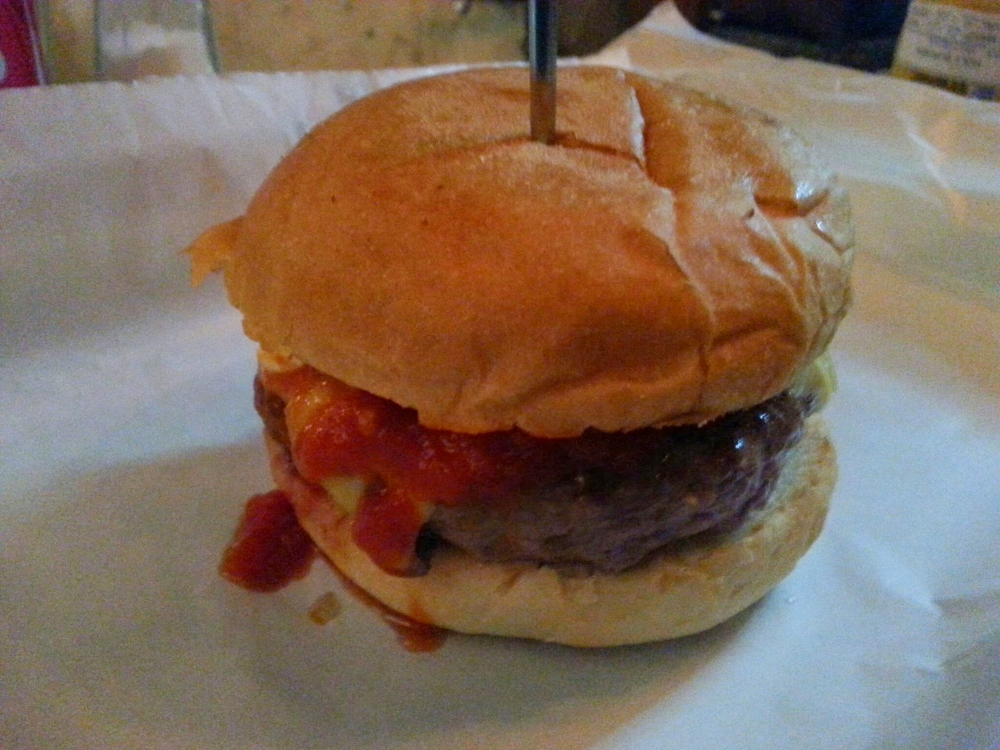

# Food Premium AI Enhancer 🍲
### Pipeline Assíncrono Multi-Agente com Guardrails de Visão Computacional e Arquitetura Resiliente

Este projeto apresenta o desenvolvimento de um pipeline inteligente ponta a ponta voltado para a validação, otimização semântica e transformação visual gastronômica. Projetado sob a ótica de engenharia de software robusta, o sistema mitiga o desperdício de recursos computacionais (tokens) em nuvem através de filtros síncronos locais e implementa tolerância a falhas via mecanismos de *Graceful Degradation*.

---

## 📊 O Pipeline em Ação (Antes vs. Depois)

Abaixo está o exemplo real do ecossistema processando uma imagem de baixa qualidade enviada pelo usuário, gerando o contexto semântico ideal e transformando-a em um ativo comercial de alto padrão.

| 📸 Foto Amadora (Input Original do Usuário) | 🚀 Resultado Comercial (Output Otimizado por IA) |
| :---: | :---: |
|  |  |

### 🤖 Prompt Gerado pelo Agente Gemini para o Modelo de Difusão (FLUX):
> "Professional food advertisement photography of a premium gourmet artisan hamburger, eye-level macro shot. A perfectly thick, juicy, seared grilled beef patty with glistening textures, draped in rich melted cheddar cheese. Vibrant, glossy gourmet red tomato relish/sauce elegantly dripping down the side. Encased in a perfectly toasted, golden-brown brioche bun. A clean wooden skewer is inserted vertically through the center of the top bun. Set on a clean, dark rustic wooden table in a high-end restaurant background with a soft, warm bokeh. High-end studio softbox lighting, cinematic rim light emphasizing textures, crisp details, appetizing presentation, commercial food styling look, 8k resolution, photorealistic."

---

🏗️ Arquitetura do Sistema e Pipeline de Dados
O ecossistema é dividido em uma arquitetura desacoplada (Backend API e Frontend de Prototipagem Rápida) operando de forma linear através de camadas especializadas:

*   **Camada de Percepção e Guardrail (RT-DETR):** O input do usuário (imagem) é interceptado por um modelo de Visão Computacional de tempo real executado localmente. Se o objeto detectado não pertencer à classe gastronômica permitida, a requisição é abortada na borda, economizando processamento e custos de API.
*   **Camada de Orquestração Semântica (Agente LLM - Gemini):** Uma vez validado, os metadados das classes detectadas são injetados em um agente especialista em Engenharia de Prompt Gastronômico, que traduz inputs amadores em descrições comerciais hiper-realistas de alta fidelidade.
*   **Camada de Geração Visual (Modelos de Difusão - FLUX):** O prompt otimizado alimenta o modelo de fundação visual para a renderização final do produto comercial.

---

## 🛡️ Destaques Técnicos e Padrões de Projeto (Design Patterns)

*   **AI Guardrails:** Implementação de regras de segurança rígidas na camada de entrada utilizando `ultralytics` (RT-DETR). O sistema autogerencia threads de CPU (`torch.set_num_threads(1)`) e memória através do modo de inferência otimizado `@torch.inference_mode()` para garantir performance concorrente estável no ambiente web.
*   **Graceful Degradation (Fallback Automático):**
    *   **No Prompting:** Caso a API do Gemini sofra timeout ou indisponibilidade, o backend intercepta a exceção e ativa um mapeamento estático local heurístico para manter a geração ativa.
    *   **Na Geração:** Caso o provedor de nuvem principal (Replicate/Flux Pro) atinja limites de cota ou créditos, o pipeline rotaciona dinamicamente a requisição para a API aberta do Pollinations AI, garantindo Alta Disponibilidade (HA) ao usuário final.
*   **Desacoplamento de Serviços:** Toda a lógica de comunicação externa e tratamento de streams de bytes HTTP foi isolada em camadas de serviços (`services.py`), blindando os controladores do framework web (`views.py`).

---

## 🛠️ Tecnologias Utilizadas

### Backend (API & AI Pipeline)
*   Python 3.10+
*   Django & Django REST Framework (DRF)
*   PyTorch / Ultralytics (Modelo Real-Time DEtection TRansformer - RT-DETR)
*   Google GenAI SDK (Modelos `gemini-2.5-flash`)
*   Replicate API / Pollinations AI Gateway

### Frontend (Interface de Operações)
*   Streamlit (Interface ágil integrada para validação de protótipos de P&D)
*   Requests / Pillow (Manipulação e transmissão de I/O de imagem em buffers de memória)

---

## 🚀 Como Executar o Projeto

### 1. Clonar o Repositório e Configurar o Ambiente
```bash
git clone [https://github.com/seu-usuario/food-premium-ai-pipeline.git](https://github.com/seu-usuario/food-premium-ai-pipeline.git)
cd food-premium-ai-pipeline
